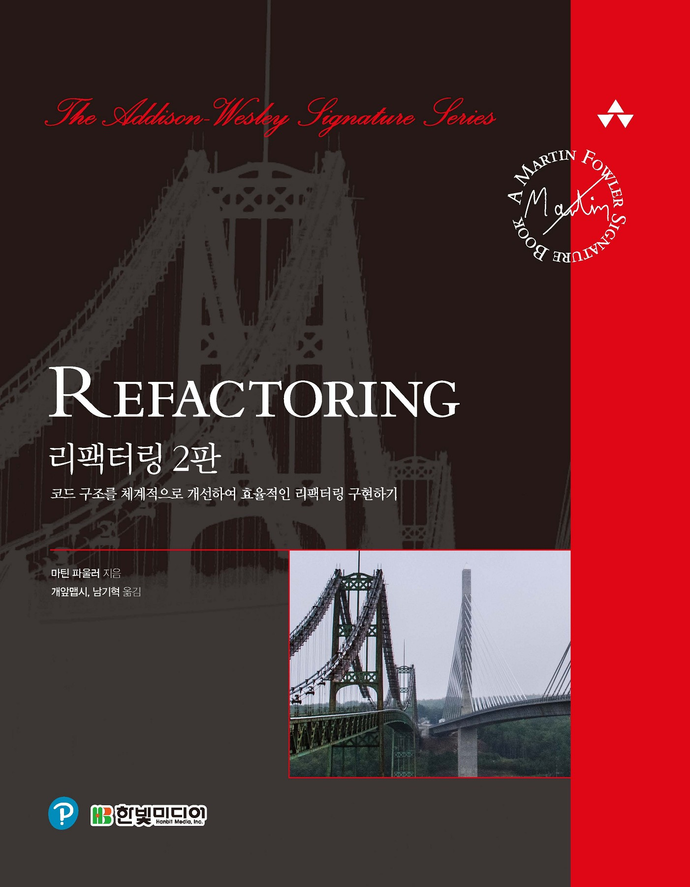

# refactoring-2e
'refactoring-2e'을 읽고 공부하며 정리하는 저장소입니다.

***

## 목차

- [Chapter 1. 리팩터링: 첫번째 예시](document/chapter01/README.md)
- [Chapter 2. 리팩터링 원칙](document/chapter02/README.md)
- [Chapter 3. 코드에서 나는 악취](document/chapter03/README.md)
- [Chapter 4. 테스트 구축하기](document/chapter04/README.md)
- [Chapter 5. 리팩터링 카탈로그 보는 법](document/chapter05/README.md)
- [Chapter 6. 기본적인 리팩터링](document/chapter06/README.md)
- [Chapter 7. 캡슐화](document/chapter07/README.md)
- [Chapter 8. 기능 이동](document/chapter08/README.md)
- [Chapter 9. 데이터 조직화](document/chapter09/README.md)
- [Chapter 10. 조건부 로직 간소화](document/chapter10/README.md)
- [Chapter 11. API 리팩터링](document/chapter11/README.md)
- [Chapter 12. 상속 다루기](document/chapter12/README.md)
